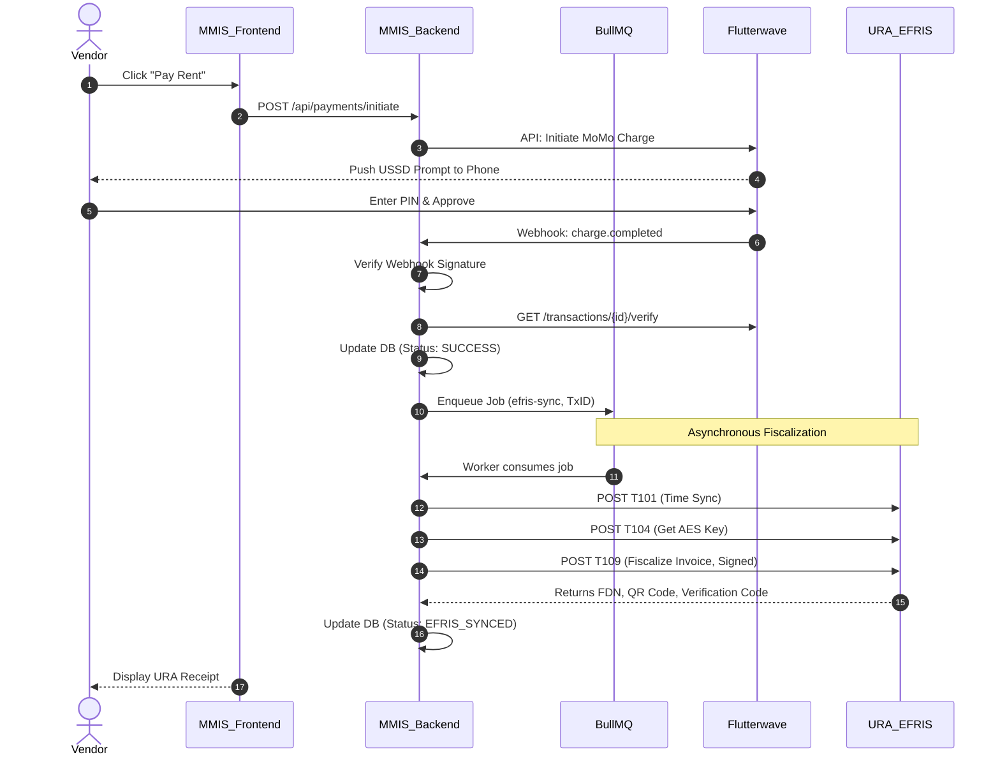
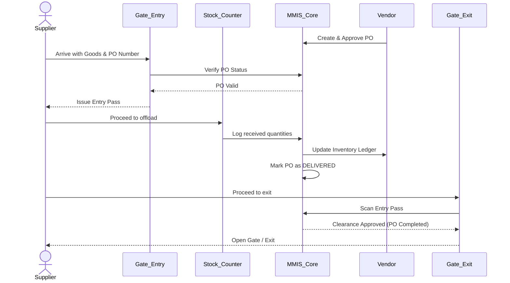

# MarketMaster MMIS: API & Integration Flows Documentation

This document provides a comprehensive overview of the MarketMaster Information System (MMIS) Payment Module, detailing the interactions between Flutterwave, URA EFRIS, and the internal systems. It also covers the physical and digital Purchase Order (PO) flow across the market's gate counters.

---

## 1. Role-Based Perspectives: Payment & Fiscalization

### 🧑‍💼 Vendor\'s Perspective (Market Tenant)
The Vendor is the primary consumer of the payment module, typically paying for shop rent or market fees.
1. **Initiation**: The vendor logs into the MMIS dashboard and selects an outstanding invoice or fee.
2. **Payment**: They choose "Pay via Mobile Money" or "Card" (powered by Flutterwave). A prompt appears on their phone (MTN/Airtel).
3. **Confirmation**: Upon entering their PIN, the payment is deducted.
4. **Fiscal Receipt**: Moments later, the vendor dashboard updates, providing a digital URA EFRIS receipt (with a QR code and Anti-fake code) proving the payment is legally recognized and taxes are declared.

### 🚚 Supplier\'s Perspective (Goods Provider)
The Supplier interacts with the physical market infrastructure and the Purchase Order (PO) system.
1. **Delivery**: The supplier arrives at the market with goods tied to a Vendor\'s PO.
2. **Gate Entry**: They present their details at the Gate Entry Counter.
3. **Stock Verification**: At the Stock Counter, the goods are verified against the PO, and the system updates the inventory.
4. **Financial Settlement**: The supplier receives payment (either directly from the vendor or via market escrow) and proceeds to the Gate Exit Counter with a digital or printed exit pass.

### 👨‍💻 Admin\'s Perspective (SuperAdmin / Market Manager)
The Admin monitors the health of the payment and fiscalization ecosystem.
1. **Monitoring**: Admins view the `AdminPaymentDashboard` to see real-time payment statuses (Initiated, Failed, Success, EFRIS_Synced).
2. **Reconciliation**: They monitor the BullMQ background jobs to ensure all successful Flutterwave payments have been successfully fiscalized by URA EFRIS.
3. **Onboarding**: Admins can upload Vendor CSVs to bulk-validate TINs against URA endpoints, ensuring all vendors are tax-compliant before they can trade in the market.

---

## 2. Deep Dive: URA-EFRIS-Flutterwave Payment Scenario

The following is a technical breakdown of what happens when a Vendor pays a 100,000 UGX rent bill.

### Step-by-Step Execution
1. **Checkout (Frontend)**: Vendor clicks "Pay". The frontend calls the MMIS backend to initialize a transaction.
2. **Flutterwave Charge (API)**: The backend calls Flutterwave\'s `/v3/charges` endpoint with the vendor\'s phone number. Flutterwave triggers a USSD push to the vendor\'s phone.
3. **Webhook Trigger (Async)**: The vendor enters their PIN. Flutterwave sends an async `POST` webhook (`charge.completed`) to the MMIS backend.
4. **Verification & State Update**: The MMIS backend validates the webhook signature, calls Flutterwave to verify the final amount, and updates the DB Transaction status to `SUCCESS`.
5. **Queueing EFRIS Job**: The `PaymentService` pushes the `transactionId` to the `efris-sync` BullMQ Redis queue.
6. **EFRIS Aggregator Worker (Background)**:
   - **T101 (Time Sync)**: Worker requests current server time from URA.
   - **T104 (AES Key Rotation)**: Worker requests a dynamic encryption key from URA.
   - **T109 (Fiscalization)**: Worker maps the transaction to URA\'s schema (18% VAT calculation), signs the payload using the `node-forge` RSA-SHA1 implementation, and POSTs to URA.
7. **Finalization**: URA returns a Receipt Number and QR Code. The worker updates the DB Transaction status to `EFRIS_SYNCED` and the Vendor can view the receipt.

### Architecture Flow Diagram



---

## 3. Complete PO Flow: Gate Entry to Gate Exit

The Purchase Order (PO) flow manages the physical movement of supplier goods into the market.

1. **PO Creation**: Vendor creates a PO in the MMIS for 50 crates of tomatoes from a Supplier.
2. **Gate Entry Counter**: 
   - Supplier arrives at the market gate.
   - Gate Clerk scans/enters the PO Number into the MMIS.
   - MMIS validates the PO is `APPROVED` and expected today.
   - MMIS issues a temporary digital/printed **Entry Pass**.
3. **Stock Counter (Weighbridge/Receiving)**:
   - Supplier proceeds to the designated vendor block/stock counter.
   - Stock Manager physically counts the goods.
   - Stock Manager updates the PO in MMIS to `DELIVERED` or `PARTIALLY_DELIVERED`.
   - MMIS automatically updates the Vendor\'s Inventory Ledger.
4. **Payment Clearing (Optional)**:
   - If terms are Cash on Delivery, the MMIS triggers a payment request to the Vendor.
5. **Gate Exit Counter**:
   - Supplier proceeds to the exit.
   - Exit Clerk scans the Entry Pass.
   - MMIS verifies the associated PO is marked `DELIVERED` and clears the supplier to leave.
   - Gate Clerk logs the supplier out.

### PO Flow Diagram



---

## 4. API Reference Documentation

### Payment & Webhook Endpoints

#### `POST /api/payments/initiate`
Initializes a payment session for a specific invoice or service fee.
- **Headers**: `Authorization: Bearer <token>`
- **Body**:
  ```json
  {
    "invoiceId": "INV-10293",
    "amount": 100000,
    "paymentMethod": "mobile_money_uganda",
    "phoneNumber": "256770000000"
  }
  ```
- **Response** `200 OK`:
  ```json
  {
    "status": "success",
    "message": "Payment initiated. Awaiting user authorization.",
    "transactionId": "TX-998877"
  }
  ```

#### `POST /api/webhooks/flutterwave`
Public endpoint utilized by Flutterwave to push status updates.
- **Headers**: `verif-hash: <Your_Webhook_Secret>`
- **Body** (Flutterwave standard):
  ```json
  {
    "event": "charge.completed",
    "data": {
      "id": 1234567,
      "tx_ref": "TX-998877",
      "status": "successful",
      "amount": 100000,
      "currency": "UGX"
    }
  }
  ```
- **Response** `200 OK` (Always return 200 immediately to prevent webhook retries).

#### `GET /api/payments/{transactionId}/status`
Polling endpoint for the frontend to check if EFRIS sync is complete.
- **Response** `200 OK`:
  ```json
  {
    "transactionId": "TX-998877",
    "status": "EFRIS_SYNCED",
    "efrisReceipt": {
      "receiptNo": "101928374",
      "verificationCode": "URA-X82-991",
      "qrCodeUrl": "https://efrisws.ura.go.ug/verify?id=..."
    }
  }
  ```

### Admin Operations Endpoints

#### `POST /api/admin/vendors/validate-tins`
Allows admins to bulk-validate TINs via URA connection.
- **Body**:
  ```json
  {
    "tins": ["1000000001", "1000000002"]
  }
  ```
- **Response** `200 OK`:
  ```json
  {
    "results": [
      { "tin": "1000000001", "status": "VALID", "businessName": "Kikubo General Ltd" },
      { "tin": "1000000002", "status": "INVALID", "reason": "TIN not found" }
    ]
  }
  ```

# Walkthrough: Database Ingestion & ETL Optimization

This walkthrough summarizes the structural upgrade to the database orchestration. We replaced the sluggish row-by-row Excel parsing script with a high-performance **ETL (Extract, Transform, Load)** architectural pattern.

## 🚀 Overview
The MMIS Market Registry requires the bulk ingestion of over 5,000 legacy rows from multi-market Excel files. Previously, parsing these files actively during the DB seed process resulted in execution times upwards of 110 seconds, pushing the database to handle over 30,000 synchronous query hits. 

By introducing a standalone ETL preprocessing script, we have completely decoupled data normalization from database insertion, driving seeding time down by an astonishing **86%**!

## 🛠️ Key Architectural Changes

### 1. Extract & Transform (The Pre-processor)
Created `scripts/preprocess-registry.ts`.
- **Functionality**: Reads `/Data/*.xlsx` and performs aggressive deduplication across all markets.
- **Normalization Strategy**: Extracts unique global vendor profiles, links cross-market facilities intelligently, maps structured constraints (like `VarChar(100)` limits), and enforces pre-calculated `.slice(0, 95)` keys.
- **Output**: Dumps a polished `registry-seed-data.json` document that Administrators can audit directly for total accuracy prior to touching a live database.

### 2. Load (The High-Speed Seeder)
Dramatically refactored `prisma/seeds/registry.ts`.
- **Parallel Promise Execution**: Stripped out synchronous `upserts` nested in dual `for` loops. Replaced them with massive `Promise.all` batches chunking at 100 rows per micro-burst.
- **Global Memory Lookup Check**: Removed the heavy PostgreSQL dependency for matching Vendors to Facilities. The seeder now uses pre-warmed JS-native mapping caches (`vendorEmailToIdMap`) that persist cross-market.

## ✅ Verification & Benchmarks Performance
- **Original Iterability**: Row-by-row `upsert` queries forcing redundant Database index sweeps on the exact same `FOOD` market categories thousands of times.
- **Original Time**: ~109.29 seconds
- **Optimized Time**: ~14.66 seconds  *(86% Speed increase)*
- **Data Integrity**: Global user deduplication properly enforces schema checks, preventing duplicate `phone` assignment crashes regardless of sheet placement.

> [!TIP]
> The isolated JSON output inside `prisma/seeds/registry-seed-data.json` allows you to immediately audit real-world anomalies or corrupted identifiers manually before triggering the production Seeder pipeline!

# MarketMaster API Documentation

Comprehensive list of endpoints for the MarketMaster MMIS Platform, categorized by functional group.

## Base URL
`{{BACKEND_URL}}/api`

---

## 🔒 Authentication & Identity
| Method | Endpoint | Description | Status |
| :--- | :--- | :--- | :--- |
| POST | `/auth/register` | Create a new user (Vendor/Supplier/Guest). | ✅ Old |
| POST | `/auth/login` | Authenticate and get JWT. | ✅ Old |
| GET | `/auth/me` | Get currently logged-in user profile. | ✅ Old |
| POST | `/auth/verify-email` | Verify email with token. | ✅ Old |
| POST | `/auth/forgot-password` | Initiate password reset. | ✅ Old |
| POST | `/auth/reset-password` | Complete password reset. | ✅ Old |
| POST | `/auth/kabale-claim/request-email` | Request email claiming for seeded Kabale accounts. | ✨ New |
| POST | `/auth/kabale-claim/verify-email` | Verify claim token. | ✨ New |
| POST | `/auth/kabale-claim/set-password` | Set password for claimed account. | ✨ New |
| GET | `/auth/verify-vendor-email` | Specific flow for invited vendors. | ✨ New |
| GET | `/auth/audit-logs` | Retrieve user audit trail. | 🚀 Possible |

## 💰 Payments & Financials (URA/Flutterwave)
| Method | Endpoint | Description | Status |
| :--- | :--- | :--- | :--- |
| POST | `/payments/evidence` | (Multipart) Upload bank slip/receipt evidence. | ✨ New |
| POST | `/payments/rent/record` | Admin records rent payment after verification. | ✨ New |
| GET | `/admin/payments/collections` | Revenue aggregation dashboard. | ✨ New |
| GET | `/admin/payments/outstanding` | List of vendors with overdue/pending rent. | ✨ New |
| POST | `/payments/initiate-momo` | Trigger Flutterwave MoMo checkout. | ✨ New |
| POST | `/payments/webhook` | Incoming Flutterwave webhook listener. | ✨ New |
| GET | `/payments/efris/sync-status` | Status of URA EFRIS fiscal sync. | ✨ New |
| POST | `/payments/efris/retry` | (SuperAdmin) Retry failed EFRIS syncs. | ✨ New |
| GET | `/reports/revenue-forecast` | AI-driven revenue projection API. | 🚀 Possible |

## 🏗️ Market & Infrastructure
| Method | Endpoint | Description | Status |
| :--- | :--- | :--- | :--- |
| GET | `/markets` | List all available markets. | ✅ Old |
| GET | `/markets/:id` | Get detailed market layout (Levels/Gates). | ✅ Old |
| GET | `/markets/search` | Search markets by name/location. | ✨ New |
| POST | `/markets/setup-shop` | Initial stall/shop assignment. | ✅ Old |
| POST | `/markets/:id/add-gate` | Register new entry/exit gate. | ✅ Old |

## 🏷️ Products & Inventory
| Method | Endpoint | Description | Status |
| :--- | :--- | :--- | :--- |
| GET | `/vendors/:vendorId/products` | List products for a specific vendor. | ✅ Old |
| POST | `/vendors/:vendorId/products` | Add new product. | ✅ Old |
| POST | `/vendors/:vendorId/products/bulk-upload` | (Multipart) Bulk import products via CSV. | ✨ New |
| PATCH | `/products/:productId` | Edit product details. | ✅ Old |
| DELETE | `/products/:productId` | Archive product. | ✅ Old |
| GET | `/products/stock-alerts` | Retrieve items with low inventory. | 🚀 Possible |

## 🛂 Gate & Security
| Method | Endpoint | Description | Status |
| :--- | :--- | :--- | :--- |
| POST | `/market/tokens/entry` | Generate entry QR token. | ✅ Old |
| GET | `/market/tokens/:code` | Scan/verify gate token. | ✅ Old |
| GET | `/market/staff/gate-counters` | List staff assigned to gates. | ✅ Old |

---

## 🛠️ Industry Standard Enhancements (Required)

1. **Webhooks Management**: `GET /webhooks` and `POST /webhooks/register` to allow external integrations.
2. **API Keys**: `POST /security/api-keys` for machine-to-machine authentication (e.g., for gate hardware).
3. **Health Check**: `GET /health` for monitoring system uptime and DB connectivity.
4. **Metrics**: `GET /metrics` (Prometheus format) for system performance monitoring.
